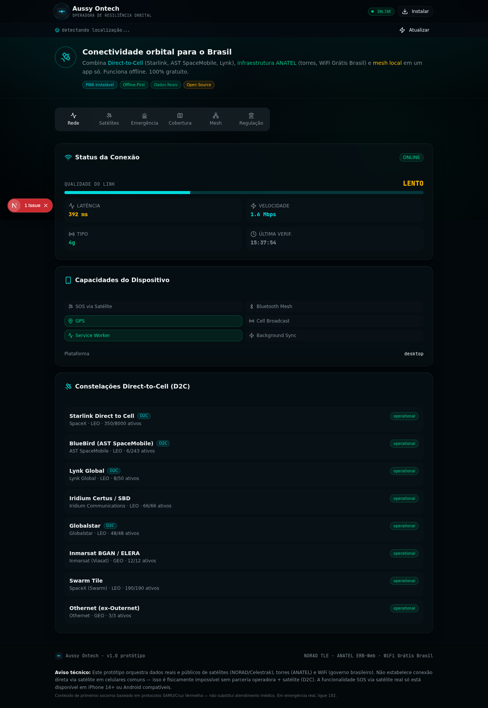

# Aussy Ontech

**PWA offline-first de resiliência, emergência e inteligência territorial para o Brasil.**

A Aussy Ontech reúne recursos de emergência, geolocalização, clima, alertas, mapas, sensores e dados orbitais em uma interface pensada para continuar útil quando a conectividade degrada ou desaparece.



## O que existe hoje

- SOS e contatos de emergência
- ficha médica em QR
- compartilhamento rápido de localização
- trilha GPS
- detecção de conectividade e fluxos para cenário sem sinal
- PWA com service worker e cache offline
- previsão e estações meteorológicas
- alertas INMET e CEMADEN
- dados de rios/ANA e municípios/IBGE
- eventos naturais e sismos
- satélites, TLEs e passagens orbitais
- mapas e recursos de orientação/sensores
- protocolos de fauna, primeiros socorros e sobrevivência
- integrações server-side em rotas Next.js para fontes públicas

## Transparência dos dados

Nem toda visualização do produto possui o mesmo nível de evidência.

- **Integrações externas:** rotas do backend consultam fontes públicas para diferentes módulos quando disponíveis.
- **Dados locais/amostrais:** alguns catálogos são amostras embarcadas no projeto para permitir demonstração e uso offline.
- **Simulações:** a visualização de ERBs/torres celulares usa posições sintéticas para demonstrar a experiência e **não representa a localização oficial de torres da ANATEL**.

Qualquer módulo usado em contexto operacional deve exibir claramente origem, data e qualidade do dado. A aplicação não substitui sistemas oficiais de emergência, orientação médica ou comunicação de missão crítica.

## Stack

- Next.js 16
- React 19
- TypeScript
- Tailwind CSS 4
- Radix UI
- PWA/service worker próprio
- Vercel como alvo principal de deploy

## Rodando localmente

Pré-requisito: Bun instalado.

```bash
bun install
bun run dev
```

A aplicação ficará disponível em `http://localhost:3000`.

### Verificações

```bash
bun run type-check
bun run lint
bun run build
```

## Variáveis de ambiente

Copie o exemplo:

```bash
cp .env.example .env.local
```

A variável principal é:

```bash
NEXT_PUBLIC_SITE_URL=http://localhost:3000
```

Em produção, configure-a com o domínio público final.

## Estrutura principal

```text
src/
  app/
    api/          # integrações e endpoints server-side
    layout.tsx    # metadata, PWA e shell global
    page.tsx      # experiência principal
  components/
    aussy/        # módulos de produto
    ui/           # componentes de interface
  hooks/          # rede, geolocalização e orientação
  lib/
    data/         # datasets e conteúdo embarcado
public/
  sw.js           # estratégias offline/cache
  manifest.json   # manifesto PWA
scripts/          # utilitários e artefatos de desenvolvimento
```

## Offline-first

O service worker mantém o app shell e diferentes categorias de dados em cache, usando estratégias específicas por tipo de recurso. O objetivo é preservar funcionalidades úteis mesmo com rede instável.

**Importante:** conteúdo em cache pode ficar desatualizado. Informações críticas devem mostrar sua origem e, quando aplicável, o momento da última atualização.

## Deploy

O projeto está configurado para Vercel. Consulte [DEPLOY.md](DEPLOY.md) para detalhes.

```bash
bun run build
```

> O repositório ainda deve versionar um lockfile do gerenciador de pacotes antes de adotar instalação estritamente congelada (`--frozen-lockfile`) em CI/produção.

## Prioridades de engenharia

1. adicionar testes automatizados para fluxos críticos de SOS/offline/geolocalização;
2. versionar o lockfile e tornar builds reproduzíveis;
3. separar a grande composição de `src/app/page.tsx` em módulos de navegação/layout;
4. formalizar contrato de qualidade/proveniência para cada fonte de dados;
5. remover datasets estáticos sem data de referência ou documentar sua validade;
6. validar comportamento PWA/offline em Android e iOS com cenários de falha de rede;
7. monitorar falhas das APIs upstream sem impedir o funcionamento offline.

## Segurança e uso responsável

Este projeto possui funções ligadas a emergência e primeiros socorros. Portanto:

- dados simulados nunca devem ser apresentados como observação oficial;
- falhas de rede devem degradar a experiência de forma explícita;
- conteúdo médico é informativo e não substitui atendimento profissional;
- números e canais oficiais de emergência têm prioridade sobre qualquer funcionalidade experimental do app.

---

**Aussy Ontech — resiliência digital para quando a rede não é garantida.**
